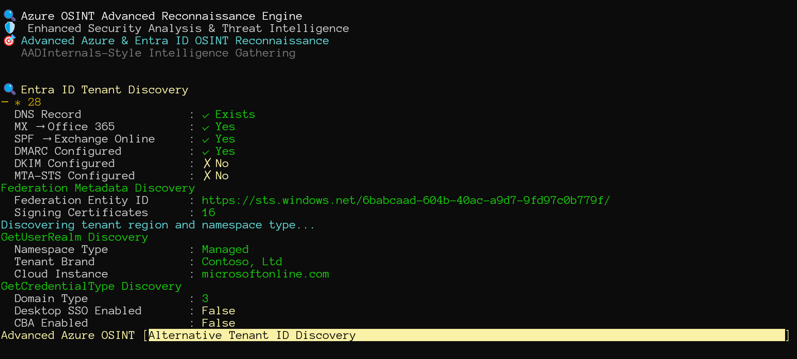
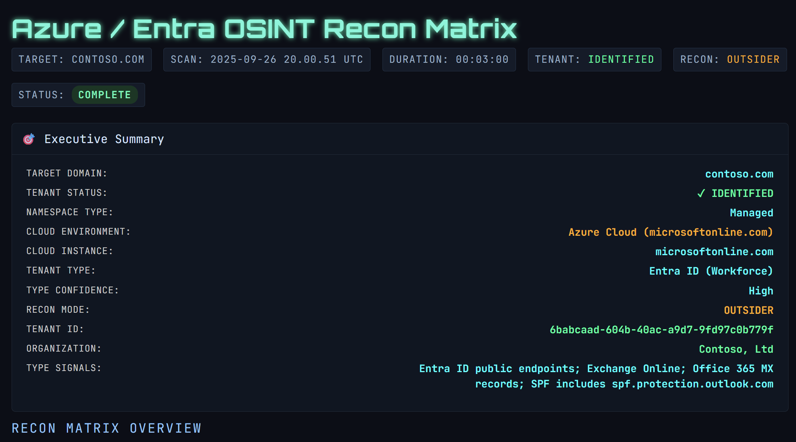

# Azure OSINT Advanced Recon Tool

## Overview

`Azure-OSINT-Advanced.ps1` is a PowerShell 7+ reconnaissance framework for Azure AD/Entra ID tenants. The script automates tenant discovery, service fingerprinting, authentication flow testing, certificate transparency research, digital footprint enrichment, and report generation. It is designed for defenders, red teams, and security researchers who need quick situational awareness across Microsoft cloud estates.

The legacy baseline scripts have been retired; this repository now focuses exclusively on the advanced workflow. The entry script is now a thin wrapper that imports the reusable module in `module/AzureOsintAdvanced.psm1`, making it easy to automate or embed specific functions in your own tooling.

## Look and feel

Running the script.



Finished HTML report.



## Requirements

- PowerShell 7.0 or newer (`pwsh` on Windows, macOS, or Linux)
- Outbound HTTPS connectivity to Microsoft cloud endpoints and public intelligence sources (e.g., `login.microsoftonline.com`, `crt.sh`)
- Optional: Azure CLI authenticated to a tenant you are authorized to test—if your CLI context matches the target tenant, insider-mode probes will execute automatically
- Optional: Web browser for viewing the generated HTML report

## Installation

```pwsh
# Clone the repository
git clone https://github.com/HarriJaakkonen/OsintTool.git
cd OsintTool

# (Windows) Allow the script to run if execution policy is restricted
Set-ExecutionPolicy -Scope Process Bypass
```

No external PowerShell modules are required; the script relies on built-in cmdlets.

## Quick Start

Run a full reconnaissance pass against a domain and collect JSON/HTML/CSV reports:

```pwsh
pwsh -NoProfile -File ./Azure-OSINT-Advanced.ps1 -Domain "contoso.com" -OutputFile "contoso-results.json"
```

During execution the script prints interactive status, automatically detects whether insider-mode is possible (based on your Azure CLI context), and opens the HTML dashboard when finished. Output files are timestamped (e.g., `contoso-results.json-20250926-182346.json`), so each run preserves history.

## Parameters

| Parameter | Type | Default | Description |
|-----------|------|---------|-------------|
| `-Domain` | `string` | *(none)* | Primary domain to investigate (e.g., `contoso.com`). Strongly recommended for every run. |
| `-TenantId` | `string` | *(auto-discovered)* | Override the tenant ID when domain discovery is ambiguous or when enumerating multi-tenant environments. |
| `-OrganizationName` | `string` | *(optional)* | Friendly organization name used for social media and GitHub enrichment. |
| `-OutputFile` | `string` | `advanced-osint-results.json` | Base filename for export artifacts; timestamped suffixes are appended automatically. |
| `-Help` | `switch` | `False` | Displays built-in help/usage information and exits. |

> Tip: Standard PowerShell flags such as `-Verbose`, `-Debug`, and `$DebugPreference = "Continue"` surface deeper logging when you are troubleshooting specific modules.

## What the Script Collects

- **Tenant Intelligence** – OpenID configuration, federation metadata, tenant branding, region, namespace type, and Azure CLI alignment
- **Authentication Flows** – Device code diagnostics, OAuth endpoint enumeration, conditional access detection, B2B invitation probing
- **Cloud Service Footprint** – Microsoft 365 portals, SharePoint, OneDrive, Teams, Power BI, Microsoft Fabric, Defender, Purview, and ROADtools-inspired Azure resource detection
- **DNS & Network Recon** – Core DNS records, Microsoft-specific subdomains, IP mapping, MTA-STS, SPF/DMARC/DKIM posture
- **Certificate Transparency** – Historical certificate inventory via `crt.sh` with resilient JSON parsing and timestamp normalization
- **Digital Footprint** – Public GitHub repositories and other OSINT sources tied to the organization name or namespace
- **Reporting Pipeline** – Normalized JSON for automation, polished HTML dashboard, and CSV summaries for spreadsheet workflows

## Output Artifacts

After each successful run you will find the following files in the repository root (timestamps omitted for brevity):

| File | Purpose |
|------|---------|
| `advanced-results.json-<timestamp>.json` | Canonical JSON export capturing every data point, suitable for ingestion or diffing between runs. |
| `advanced-results.json-<timestamp>.html` | Interactive report automatically opened at the end of the scan. |
| `advanced-results.json-<timestamp>.csv` | Tabular breakdowns (one CSV per major module) for spreadsheet review. |

The base filename mirrors the `-OutputFile` value you supply. Old runs are never overwritten; delete them manually when no longer needed.

## Insider vs. Outsider Recon

The script detects your current Azure CLI login:

- **Insider Mode** – Triggered when the authenticated tenant matches the target domain/tenant ID. Additional authenticated probes (where permissible) are executed once.
- **Outsider Mode** – Default for unauthenticated scans or mismatched tenants. Only publicly reachable endpoints are touched.

Status lines in the console explicitly call out which mode is active so you can ensure the desired posture before proceeding.

## Extending or Automating

The script exposes rich helper functions (e.g., `Start-AdvancedReconnaissance`, `Export-AdvancedResults`) that can be dot-sourced in your own automation:

```pwsh
Import-Module "$PSScriptRoot/module/AzureOsintAdvanced.psd1" -Force

$results = Invoke-AzureOsintAdvanced -Domain "contoso.com" -OrganizationName "Contoso" -NoAutoOpen -PassThru
Export-AdvancedResults -Results $results.Results -OutputPath "contoso-results.json"
```

This approach is useful when chaining the reconnaissance output into SIEM ingestion, alerting pipelines, or scheduled tasks.

## Troubleshooting

- Ensure you are running PowerShell 7+. Windows PowerShell 5.1 lacks several cmdlet features relied upon by the script.
- High-latency networks or web filters can cause timeouts; rerun with `-Verbose` to pinpoint failing modules.
- If HTML report auto-launch fails in headless environments, open the generated file manually in your browser.
- Reuse of the same output filename is safe—timestamp suffixes guarantee unique files. Clean up older reports to keep the repository tidy.

## Responsible Use

Only execute reconnaissance against domains and tenants you own or have explicit permission to test. Follow responsible disclosure practices, respect rate limits, and comply with all applicable laws.

## Contributing & Support

Bug reports, feature requests, and pull requests are welcome. Please include reproduction steps and, where possible, sanitized output snippets. For discussions or questions, open an issue in the GitHub repository.

## License

This project is released under the MIT License. See `LICENSE` for the full text.